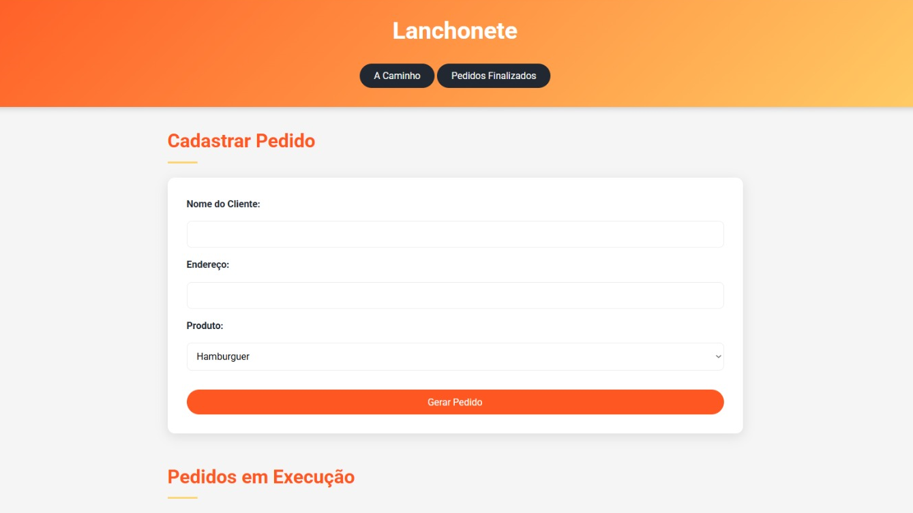
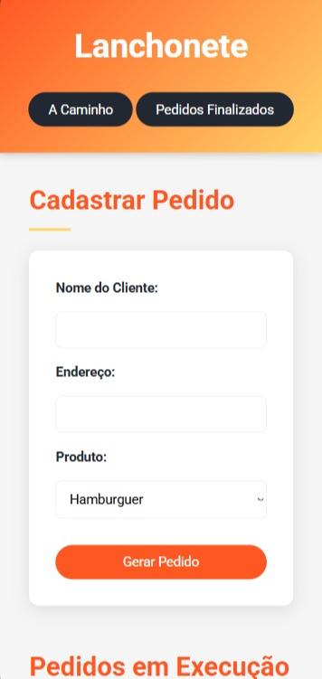
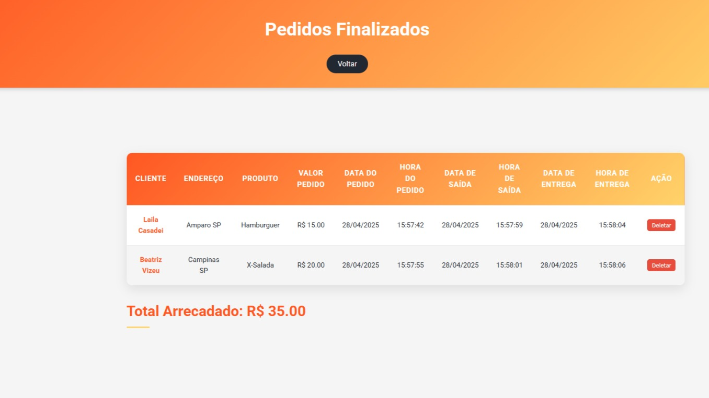
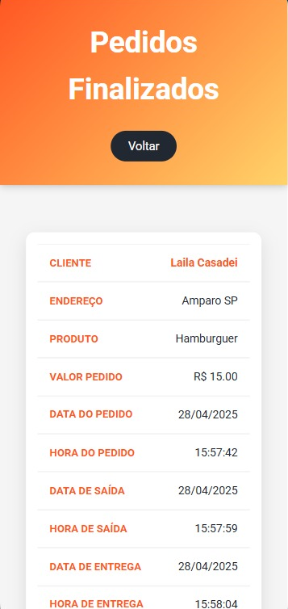

# Lanchonete Delivery
Projeto de front-end utilizando HTML, CSS e JavaScript.
## Conhecimentos
- localStorage
- DOM
- Eventos
- Manipulação de elementos
- Manipulação de classes
- Manipulação de estilos
- Modais
- Manipulação de formulários

## Wireframes

|Web|Mobile|
|-|-|
|||
|||

---------
***Feito por Laila Casadei Macêdo***